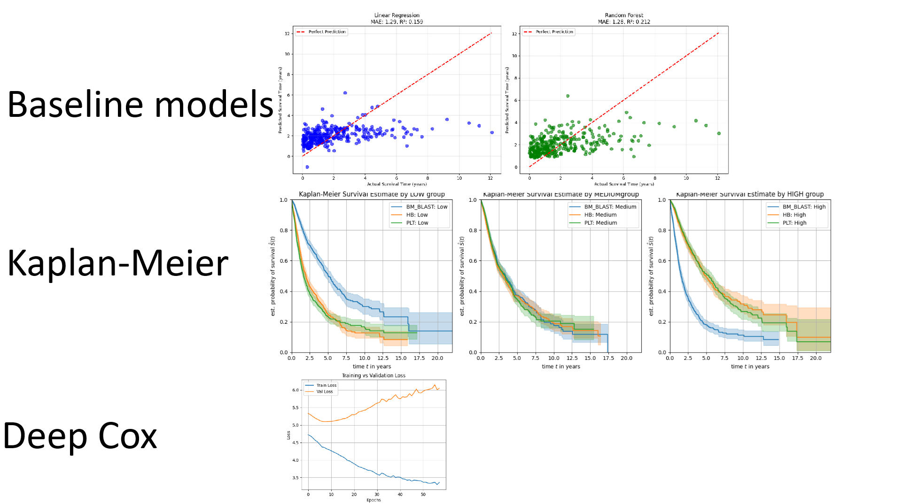

# Overall Survival Prediction for patients diagnosed with Myeloid Leukemia

## Repository Link

https://github.com/kaSae6/PredictLeukemiaSurvival

## Description

[Short project description here. Briefly summarize the problem you are trying to solve and the approach you're taking.]

Project description:Survival Analysis

The dataset from [https://challengedata.ens.fr/challenges/162]
 , was a Challenge for the prediction of the Overall Survival of Cancer Patients with Acute Myeloid Leukemia. 
One of the main goals was to predict the overall survival of AML-patients with Methods of the field of Survival Analysis. 
The Survival analysis describes a time-to event regression problem which is different to a regular regression due to "censoring". The used dataset was "right-censored",  which occurs often in the field of Life-Sciences and Medicine.

The provided dataset included information  of a time variable and event-indicator for each Patient, which means the survived time from receiving diagnosis until death, or the last time of a check-up appointment when alive.  This created the problem of different states (Event: alive or dead), together with survival-time and other possible covariates as blood work data to create a prediction of survival. 

After thorough Analysis, we approached this problem naively with a linear regression, which meant to only include patients with the event of "death" since linear regression can't handle censoring.
Further methods were chosen especially to to examine right-censored data, included non-parametric Kaplan-Meier Survival probability, semi-parametric cox proportional hazard,as well as a deep-cox model.

### Task Type

[Time-to-event regression]

### Results Summary

- **Best Model:** [Name of the best-performing model]
- **Evaluation Metric:** [e.g., Accuracy, F1-Score, MSE]
- **Result:** [e.g., 95% accuracy, F1-score of 0.8]

## Documentation

1. **[Literature Review](0_LiteratureReview/README.md)**
2. **[Dataset Characteristics](1_DatasetCharacteristics/exploratory_data_analysis.ipynb)**
3. **[Baseline Model](2_BaselineModel/baseline_model.ipynb)**
4. **[Model Definition and Evaluation](3_Model/model_definition_evaluation)**
5. **[Presentation](4_Presentation/README.md)**

## Cover Image

